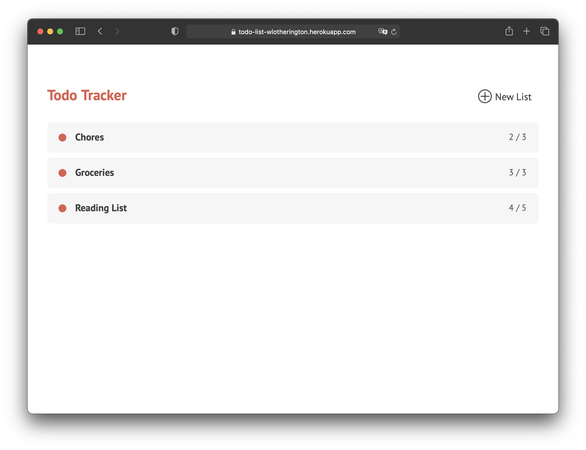
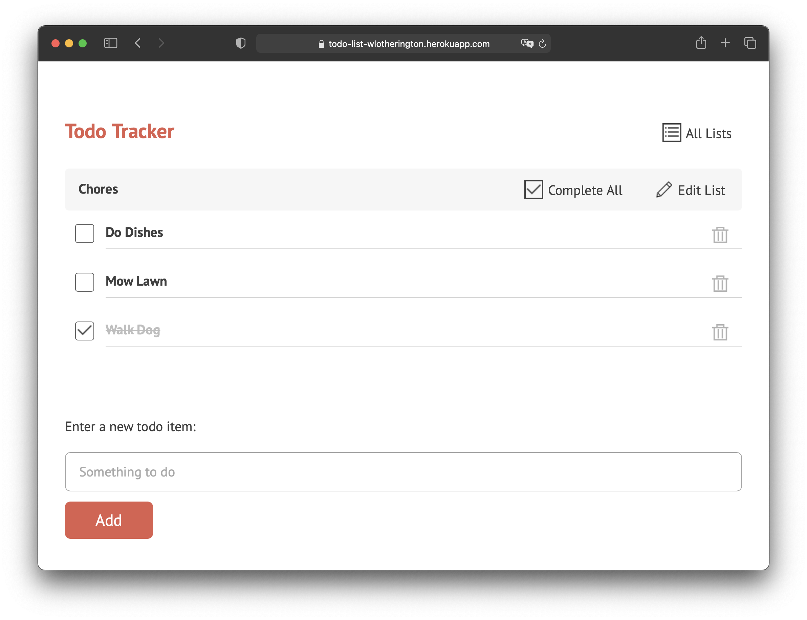
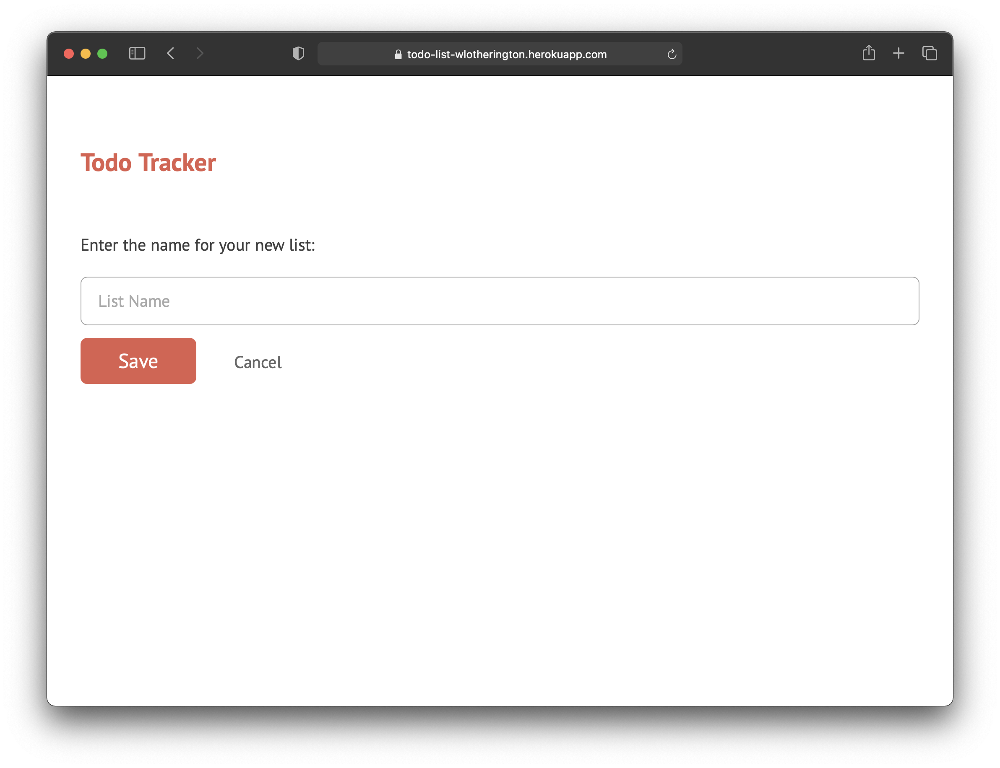

# Todo List

* **Try it out:** 
* **Stack:** `Ruby`, `Sinatra`, `jQuery`
* **Feedback:** [Will.Lotherington@hey.com](Will.Lotherington@hey.com)

### What is it?
Todo list app built with `Ruby`, `Sinatra`, and a `jQuery`

